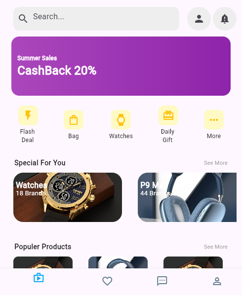

# Flutter UI Design Assignment  

This Flutter project showcases a modern and user-friendly mobile app interface. Key features include:  
- **Search Bar** with icons for shopping cart and filters.  
- **Promotional Banner** with a gradient background and rounded corners.  
- **Shortcut Icons** for quick navigation using a grid layout.  
- **"Special for You" Section** with horizontally scrollable product cards.  
- **"Popular Products" Section** displayed in a responsive grid format.  
- **Bottom Navigation Bar** for seamless app navigation.  

The design emphasizes clean visuals, responsive layouts, and modular code for easy customization.

---

### App Screenshot  

